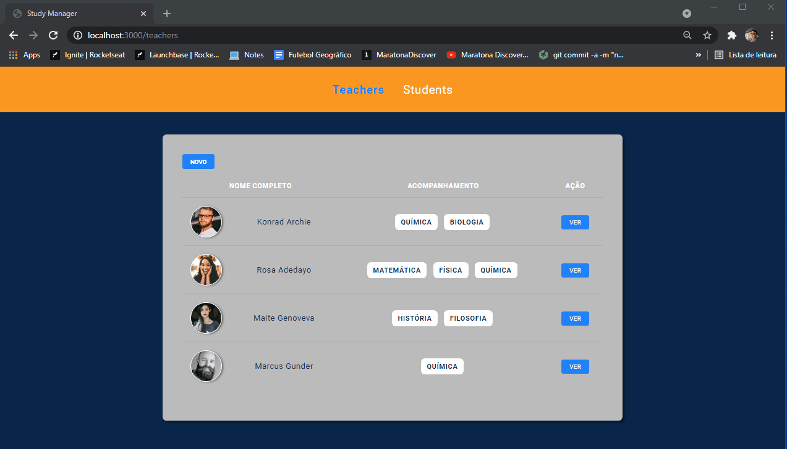
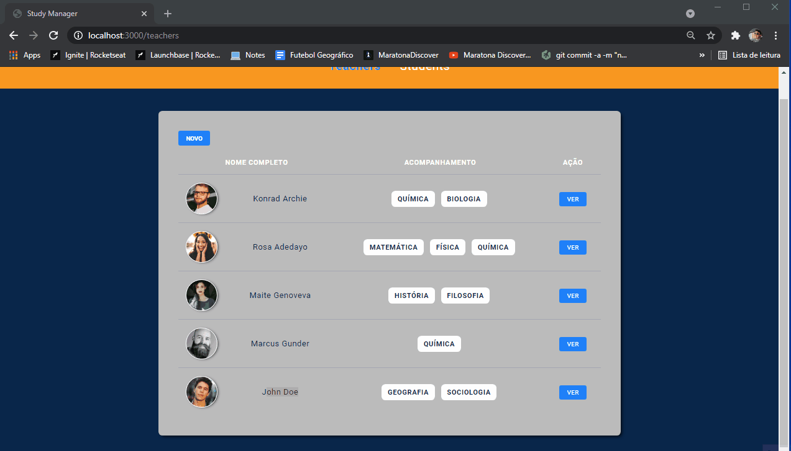
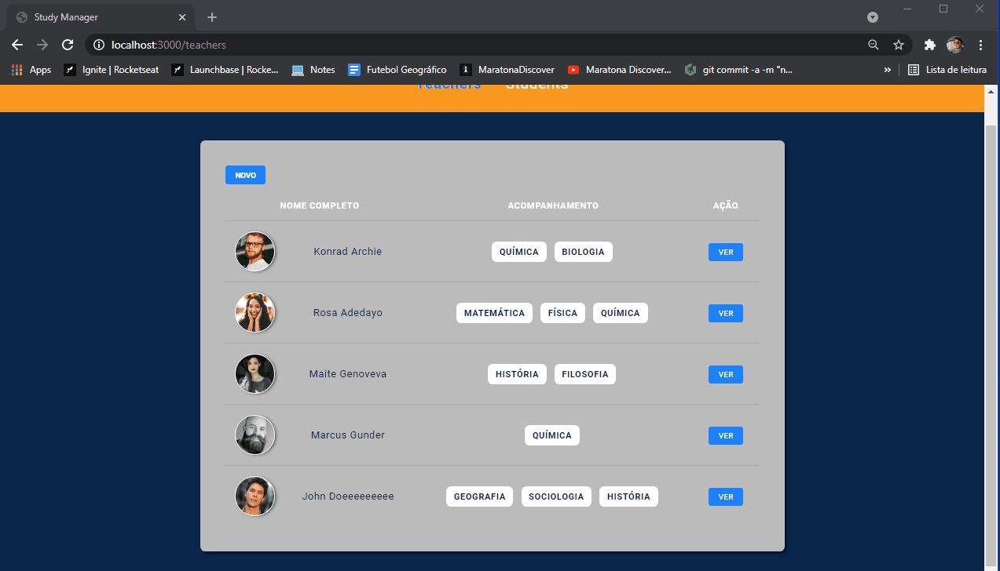

# Study Manager

Project being developed for Launchbase Bootcamp (Rocketseat).

Application that registers teachers and students in order to practice my HTTP skills, using forms, adding, deleting...

## Functionalities

### Creating teacher profile

### Editing teacher profile

### Deleting teacher profile

### Same process but for the student profile

### Responsive interface

Updated Notes: 
- HTTP and Backend is here! Working with req.body to receive data
- Creating routes using req.params to go to an specific teacher
- The Nunjucks Template Engine is being used in order to not use static data in our HTML
- Now we can edit the teachers profile using put and delete methods (using method-override)
- Fixed some bugs that were duplicating the id's in the database
- Now the home page has a table showing all the teachers + a button to go to the teacher profile
- Button to create new teacher or new student
- We prevent the user from deleting its profile by accident using the confirm() method before submiting the form-delete
- Responsive interface has been added

Images randomly generated by the Unsplash API (only in the create page bc we don't have a picture yet)
The rest of the pictures are also from Unsplash

##### Developed by Caíque Rodrigues - Web Development Student :tada: