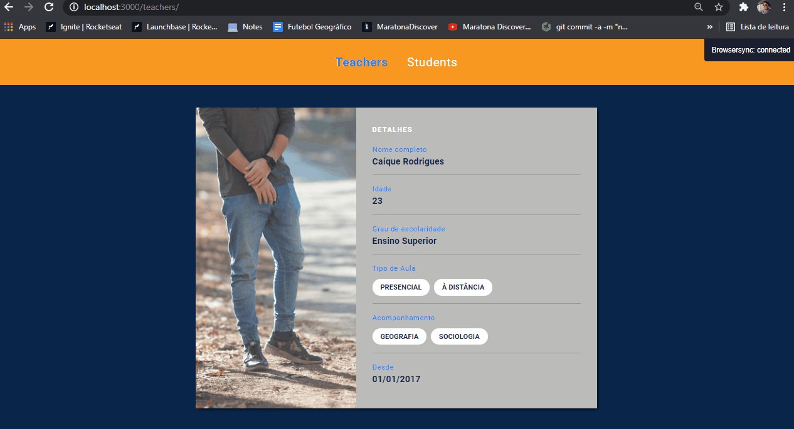

# Study Manager

Project being developed for Launchbase Bootcamp (Rocketseat).

Application that registers teachers and students in order to practice my HTTP skills, using forms, adding, deleting...

Updated Notes: 
- HTTP and Backend is here! Working with req.body to receive data
- Creating routes using req.params to go to an specific teacher
- The Nunjucks Template Engine is being used in order to not use static data in our HTML
- Now we can edit the teachers' profile

Images randomly generated by the Unsplash API (soon it will change)

##### Developed by Caíque Rodrigues - Web Development Student :tada: